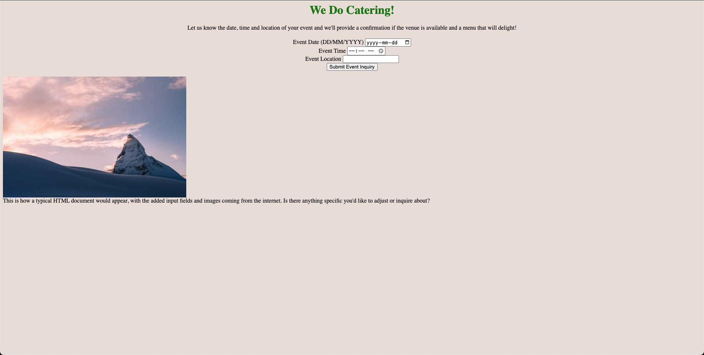

# SiteSynth

 

### Dynamic Website Generator
SiteSynth is a dynamic website generator which harnesses the power of Cohere's generate API and LLM's to streamline the web development process.

SiteSynth provides developers of any skill set with a tool to quickly generate designs for any website they can think of.

### Usage
To generate a website you simply enter your prompt and press enter. After a few seconds, a fully stylized website will appear. This website is editable, meaning that the user can select elements on the website and easily change them. Once you are happy with your website, you can return to the main page and download a copy of the HTML source code.

### Examples
Here is an example of a website generated by SiteSynth with the prompt "catering homepage":

### Note
The current demo <a href="https://site-synth.vercel.app/main/">here</a> does not fully work because of latency from the API.